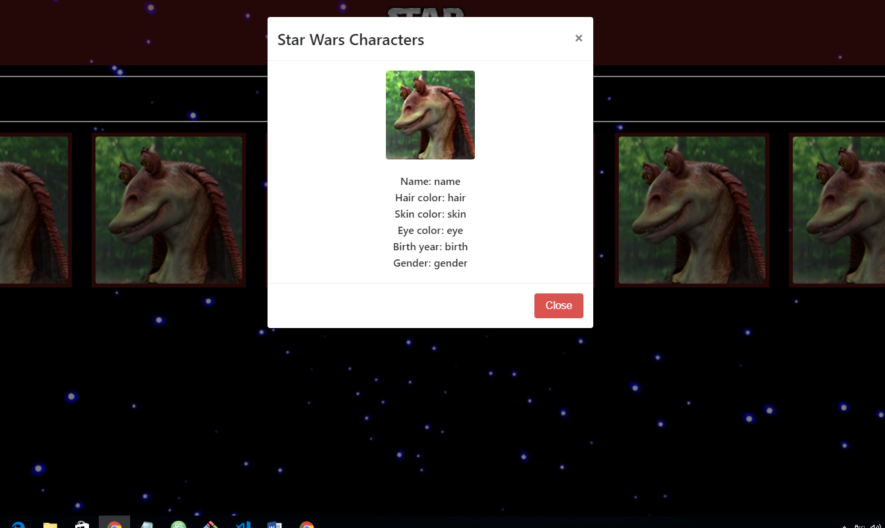
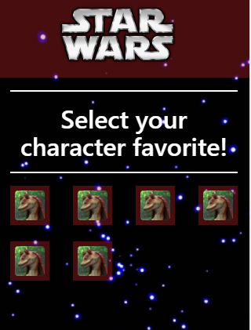

# Swapi
---

## ¿Qué es Swapi?
Es una API la cual se encuentra fusionado de manera creativa con la primeras letras de "Stars Wars" y "API" y es una fuente de datos cuantificada y accesible por programas del mundo para todos los datos del universo canónico de Star Wars!contenido en línea, presentando a todos los personajes, películas, especies, naves espaciales, vehículos y planetas de Star Wars.

## ¿Cómo usar Swapi ?
Se puede acceder a todos los datos a través de la API web HTTP.
También proporcionan bibliotecas de ayuda para los lenguajes de programación populares para que pueda usar swapi en el lenguaje de programación favorito, en el estilo que más le convenga.

## Iniciando Swapi

* Se Abre una terminal y se usa el curl o httpie para hacer una solicitud API para un recurso. En el siguiente ejemplo, se trata de obtener el primer planeta, Tatooine:

* Por aporte de la api se indica Utilizar httpie para los ejemplos, ya que muestra las respuestas muy bien y nos da mucha más información útil. Si no se desea asi, simplemente use el comando curl .

* Y asi se realizaria el uso gratuito de esta API

## Lo que Proporciona
### Codificaciones
SWAPI proporciona dos codificaciones para que usted represente los datos con:

JSON - es el formato de datos estándar proporcionado por SWAPI de forma predeterminada.

Wookiee - es para los fanaticos de corazon que saben y reconocen el idioma wookiee, esta codificación es idéntica a JSON, excepto con traducciones wookiee.

* https://swapi.co/api/planets/1/?format=wookiee

### Atributos:
Los atributos que presenta esta Api son los siguientes:
* name: El nombre de esta persona.
* birth_year : El año de nacimiento de la persona, usando el estándar en el universo de BBY o ABY - Antes de la Batalla de Yavin o Después de la Batalla de Yavin.
* eye_color : El color de ojos de esta persona. Será "desconocido" si no se conoce o "n / a" si la persona no tiene un ojo.
* gender : El género de esta persona. Ya sea "Hombre", "Mujer" o "desconocido", "n / a" si la persona no tiene un sexo.
* hair_color:  El color de cabello de esta persona. Será "desconocido" si no se conoce o "n / a" si la persona no tiene cabello.
* height cuerda: La altura de la persona en centímetros.
* mass: La masa de la persona en kilogramos.
* skin_color: El color de la piel de esta persona.
* homeworld: La URL de un recurso planetario, un planeta en el que esta persona nació o habita.
* films: una matriz de URL de recursos de película en la que ha estado esta persona.
* species: conjunto de URL de recursos de especies a las que pertenece esta persona.
* starships: una matriz de URL de recursos de nave espacial que esta persona ha probado.
* vehicles: una matriz de URL de recursos de vehículos que esta persona ha probado.
* url: la URL hipermedia de este recurso.
* created: el formato de fecha ISO 8601 de la hora en que se creó este recurso.
* edited: el formato de fecha ISO 8601 de la hora en que se editó este recurso.

### Swapi en Java
* Aparte de encontrarse originalmente esta API en Phyton tambien esta para Java y otros mas.

## Acerca del Creador
*  Paul Hallett realizando la Api de pokemon se inspiro en la pelicula de stars wars y decidio crear esta nueva API en base a todos los datos recopilados de la pelicula Stars Wars.

## Imagenes :

### Desktop

### Mobile

## Formas de distribucción del proyecto
* Andrea : Manejo de la API Swapi
* Yosselyn: Enmaquetado de las ventanas.
* Yolanda : Readme y busqueda de información.

## Integrantes :
+ Yosseline.
+ Andrea
+ Yolanda
